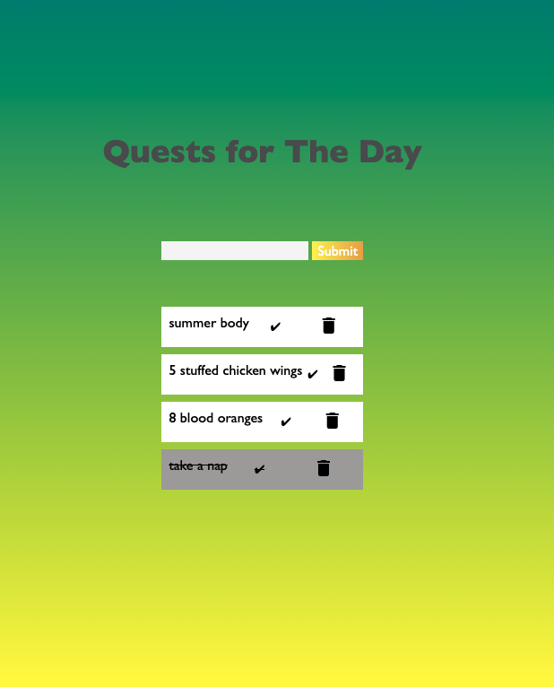

# To-Do List

## Description
Duration: 8+ hours

Create a to-do list that allows user to add, update, and delete tasks.
When adding task. It will show on the DOM and stored in the database.
The update will allow user to mark the task as completed and change the background color of that task.
The delete will delete it on both the user and database end.

It was challenging creating a checkbox and changing the background color once a task was completed.

## Installation
- HTML
- Javascript
- jQuery
- CSS
- SQL Database (this project use's Postico)

## Database
Create a new database through Postico, using the name weekend-to-do-app. Don't forget to use this name in your database connection configuration on your server.

## Styling
Bring some CSS style to the font family, size and color, and background color. Text color and/or background color of that task to change showing it has been completed.

## Built With

- Visual Code
- Postico

## Screen Shot

## Acknowledgement

Thanks to [Prime Digital Academy](www.primeacademy.io) who equipped and helped me to make this application a reality. Thanks to our insturctors - Liz and Dane for their guidance and dynamatic teaching skills. Last, but not least Thanks to all my classmates for their support and estatic attitude.
